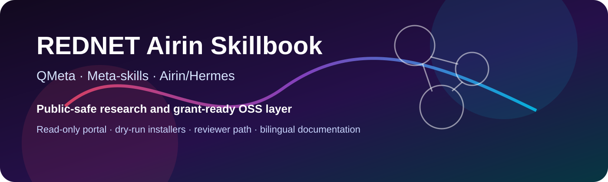
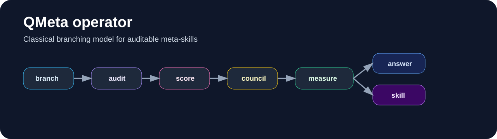

<div align="center">

<a href="docs/index.md">
  
</a>

# REDNET Airin Skillbook

**Публично-безопасная книга навыков для QMeta, Airin/Hermes, воспроизводимых исследований, dry-run-инструментов и open-source сопровождения под грантовые заявки.**

[English version](README-EN.md) · [Документация](docs/index.md) · [Установка](INSTALL.md) · [Навыки](docs/skills.md) · [QMeta](docs/qmeta-scientific-model.md) · [Пакет заявок](grants/README.md) · [Граница приватности](docs/privacy-boundary.md)

</div>

## Обзор

REDNET Airin Skillbook — публично-безопасный open-source репозиторий для исследований агентных процессов и повторно используемых мета-навыков. Он представляет систему навыков Airin/Hermes, ветвящуюся модель QMeta, материалы read-only портала, dry-run установку, релизную дисциплину и пакет заявок на доступы/гранты без раскрытия приватного runtime-состояния.

Репозиторий рассчитан на ревьюеров, сопровождающих open-source проекты, исследователей и потенциальных партнёров, которым нужно понять проект без доступа к закрытой инфраструктуре. В публичный слой входят документация, installable skill cards, синтетические примеры, схемы, протоколы и очищенные исследовательские сводки.

## Что такое QMeta

QMeta — классическая инженерная модель мета-навыков. Она не утверждает физическое квантовое вычисление, сознание модели, магические свойства или нелокальные эффекты. Квантово-информационные термины используются только как инженерные аналогии для ветвления, коррекции ошибок, ансамблевой оценки, пороговых режимов и трассируемой памяти решений.

Базовый процесс:

```text
branching -> audit -> score -> council -> interference -> measure -> answer | skill
```

Обычный навык помогает получить ответ. Мета-навык меняет сам процесс: критерии, уровень осторожности, политику памяти, режим проверки, структуру ветвей и журнал причин решения.



## Почему репозиторий важен

Длинные агентные workflow часто ломаются одинаково: теряют связность, смешивают факты с предположениями, игнорируют неопределённость или создают результат, который трудно проверить позднее. REDNET Airin Skillbook решает эти проблемы через явные процессные контуры:

- ветвление и сравнение нескольких траекторий решения;
- разделение фактов, гипотез, метафор и действий;
- dry-run first установка и read-only preview;
- строгая публично-приватная граница;
- повторно используемые skill cards и проверочные чеклисты;
- двуязычная документация для международного ревью.

## Маршрут ревьюера

Для грантов, доступа к моделям или open-source ревью рекомендуемый порядок чтения такой:

1. [QMeta / Airin grant positioning](docs/qmeta-grant-positioning.ru-en.md)
2. [Черновики заявок OpenAI](grants/openai-applications.ru-en.md)
3. [Codex Open Source Fund note](grants/openai-codex-fund.md)
4. [Scientific grant radar](grants/scientific-grant-radar.ru-en.md)
5. [Граница приватности](docs/privacy-boundary.md)
6. [Научная модель QMeta](docs/qmeta-scientific-model.md)
7. [Сводка проверки закрытого архива](docs/closed-archive-audit-2026-06-27.ru-en.md)

## Карта репозитория

| Раздел | Назначение |
|---|---|
| `skills/` | Устанавливаемые и концептуальные навыки для REDNET / Airin / Hermes. |
| `packages/qmeta/rednet-airin-qmeta/` | Python-пакет и optional MCP-сервер для ветвящегося движка QMeta. |
| `research/rednet-quiet-step-lab/` | Публично-безопасный исследовательский конвейер: карточки находок, module packs, эксперименты. |
| `portal/` | Статическая read-only PWA-витрина. |
| `docs/` | Архитектура, навигация, граница приватности, release checks и документы QMeta. |
| `grants/` | Пакет заявок на гранты и доступ к моделям. |
| `assets/` | Публичные схемы, баннеры, иконки и визуальные карты. |

## Грантовый фокус

Репозиторий подготовлен под четыре основных направления подачи:

| Направление | Что запрашивается |
|---|---|
| OpenAI Codex for Open Source | ChatGPT Pro with Codex, API credits и поддержка maintainer workflow. |
| OpenAI Codex Open Source Fund | API credits для QMeta evaluations и open-source сопровождения. |
| OpenAI Trusted Access / defensive research support | Поддержка авторизованного code review, patch validation и maintainer checklists. |
| OpenAI Researcher Access Program | API credits для оценки QMeta на публично-безопасных синтетических задачах. |

Дополнительные провайдеры и грантовые варианты собраны в [grants/provider-radar.md](grants/provider-radar.md) и [grants/scientific-grant-radar.ru-en.md](grants/scientific-grant-radar.ru-en.md).

## Визуальные материалы

| Файл | Назначение |
|---|---|
| [rednet-banner.svg](assets/rednet-banner.svg) | Главный баннер репозитория. |
| [qmeta-operator.svg](assets/qmeta-operator.svg) | Схема оператора QMeta. |
| [airin-icon.svg](assets/airin-icon.svg) | Иконка визуальной идентичности Airin. |
| [skillbook-map.svg](assets/skillbook-map.svg) | Карта структуры репозитория. |
| [install-flow.svg](assets/install-flow.svg) | Схема безопасной установки. |

## Быстрый старт

### Dry-run установка

```powershell
powershell -ExecutionPolicy Bypass -File packages\hermes\rednet-airin-meta-skills\install.ps1 -DryRun
```

Режим dry-run показывает планируемые операции и не копирует файлы.

### Read-only портал

```powershell
python -m http.server 8795
```

Открыть:

```text
http://127.0.0.1:8795/portal/
```

## Публичная граница

В публичный репозиторий входят очищенная документация, схемы, синтетические примеры, installable skill cards, read-only demos, чеклисты ревью и грантовые сводки.

В публичный репозиторий не входят сырые приватные диалоги, личные записи, локальные runtime-выгрузки, приватные значения инфраструктуры, production data, access material и закрытые архивы как есть.

Каноническая граница описана в [docs/privacy-boundary.md](docs/privacy-boundary.md).

## Статус

Репозиторий готовится как funding-grade public open-source showcase. Цель — сделать проект понятным, двуязычным, проверяемым и безопасным для внешних ревьюеров, оставляя приватные материалы вне публичного слоя.
