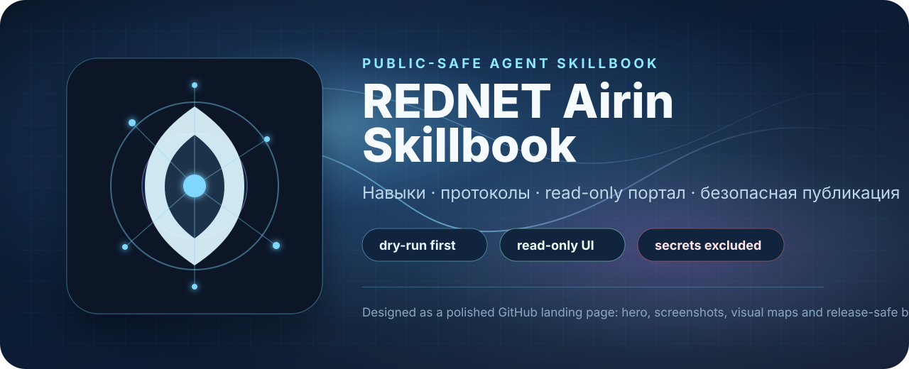
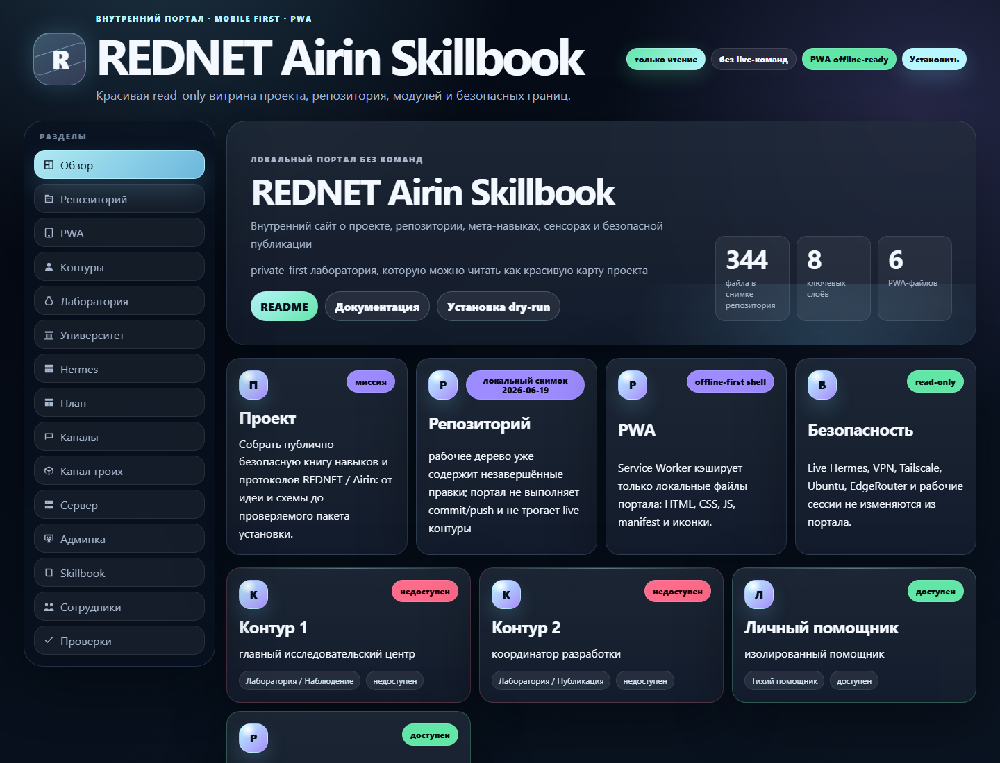
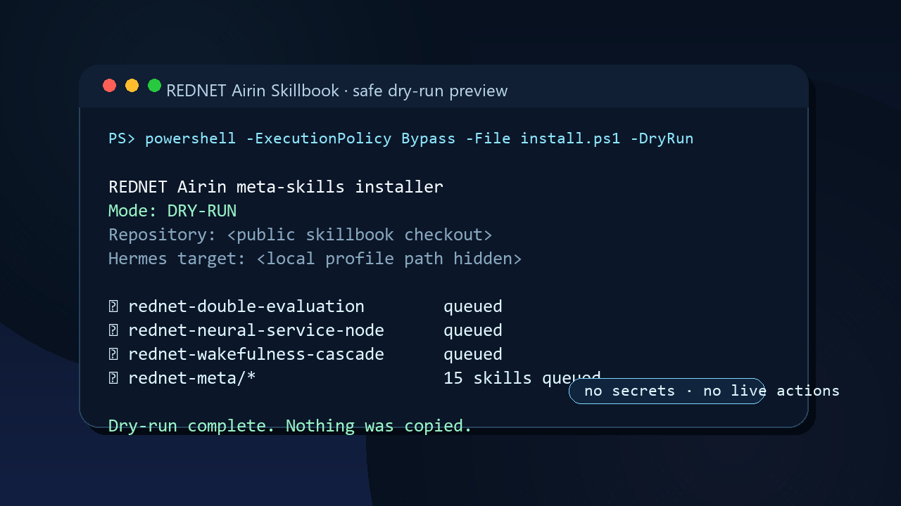
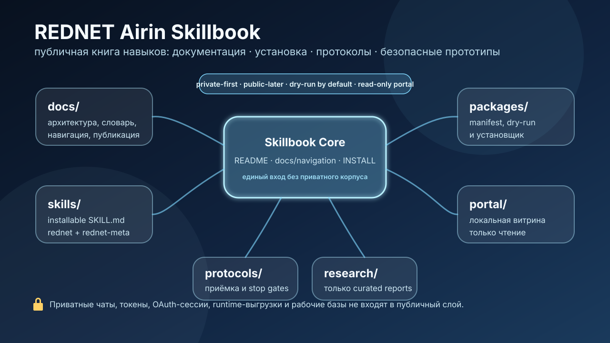
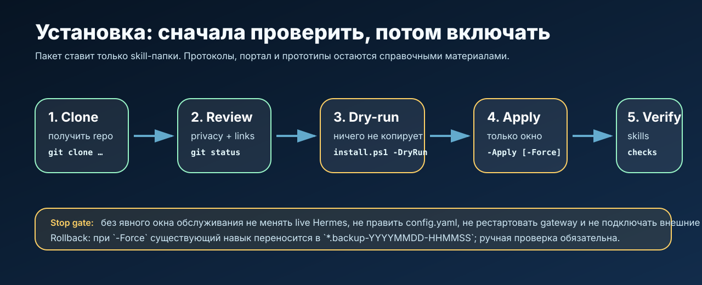

<div align="center">

<a href="docs/index.md">
  
</a>

# REDNET Airin Skillbook

**QMeta · Airin/Hermes · Meta-skills · Read-only portal · Public-safe research layer**

[Документация](docs/index.md) · [Installation](INSTALL.md) · [Skills](docs/skills.md) · [QMeta](docs/qmeta-scientific-model.md) · [Grants](grants/README.md) · [Privacy boundary](docs/privacy-boundary.md)

[](#status--статус)
[](INSTALL.md)
[](portal/README.md)
[](docs/privacy-boundary.md)
[](docs/qmeta-grant-positioning.ru-en.md)

</div>

> **RU:** это не дамп рабочей среды и не личный дневник разработки. Это публично-безопасная витрина REDNET / Airin: QMeta-модель, installable skills, протоколы, read-only portal, грантовые заявки и проверяемые прототипы без доступа к приватному контуру.
>
> **EN:** this is not a live environment dump or a private development diary. It is a public-safe REDNET / Airin showcase: QMeta model, installable skills, protocols, read-only portal, grant applications, and auditable prototypes without access to private runtime material.

## What this is / Что это

**REDNET Airin Skillbook** is a bilingual public-safe skillbook and research scaffold for agent workflows built around **Airin/Hermes** and **QMeta**.

QMeta is a **classical engineering model for meta-skills**. It uses branching, audit, scoring, council review, convergence, measurement, and skill crystallization to make long-running AI work more traceable and safer.

```text
branching -> audit -> score -> council -> interference -> measure -> answer | skill
```

The project does **not** claim physical quantum computation, model consciousness as fact, magic, or non-local effects. Quantum-information language is used only as an engineering analogy for error correction, ensemble evaluation, threshold behavior, and traceable decision memory.

## Grant-ready focus / Грантовый фокус

This branch adds a dedicated public application pack for model access, API credits and research programs:

| Area | Link |
|---|---|
| OpenAI and grant application drafts RU/EN | [grants/openai-applications.ru-en.md](grants/openai-applications.ru-en.md) |
| External AI/API access radar | [grants/external-ai-access.ru-en.md](grants/external-ai-access.ru-en.md) |
| Scientific and open-source grant radar | [grants/scientific-grant-radar.ru-en.md](grants/scientific-grant-radar.ru-en.md) |
| Submission checklist | [grants/submission-checklist.ru-en.md](grants/submission-checklist.ru-en.md) |
| QMeta reviewer positioning | [docs/qmeta-grant-positioning.ru-en.md](docs/qmeta-grant-positioning.ru-en.md) |
| Grant architecture map | [docs/grant-architecture-map.ru-en.md](docs/grant-architecture-map.ru-en.md) |

Primary target applications:

1. **Codex for Open Source** — maintainer workflow, code review, docs, tests, release hardening.
2. **Cybersecurity Grant / Trusted Access for Cyber** — defensive review and patch validation for owned/open-source WordPress/PWA/DevOps components.
3. **Researcher Access Program** — QMeta evaluation for safer long-running agent workflows.

## Archive review / Проверка закрытого архива

The closed project archive was inspected and compared with the public archive. It was **not** copied directly into the repository.

| Result | Link |
|---|---|
| Closed archive audit summary | [docs/closed-archive-audit-2026-06-27.ru-en.md](docs/closed-archive-audit-2026-06-27.ru-en.md) |
| RedNET Fast Memory public outline | [docs/rednet-fast-memory-public-outline.ru-en.md](docs/rednet-fast-memory-public-outline.ru-en.md) |
| Low-resource memory/routing module pack | [research/rednet-quiet-step-lab/modules/packs/low-resource-memory-and-routing.ru-en.md](research/rednet-quiet-step-lab/modules/packs/low-resource-memory-and-routing.ru-en.md) |

Only sanitized architecture ideas were moved forward: local memory as a research model, read-only preview, dry-run install philosophy, deterministic analysis, digest, safety gates, and low-resource routing experiments.

## Visual showcase / Визуальная витрина

| Read-only portal | Safe dry-run | Skillbook map |
|---|---|---|
|  |  |  |
| [Portal guide](portal/README.md) | [Install guide](INSTALL.md) | [Navigation](docs/navigation.md) |



Additional public diagram: [Grant architecture map](docs/grant-architecture-map.ru-en.md).

## Features / Возможности

- **Dry-run first:** installers preview actions before changing anything.
- **Read-only portal:** static PWA showcase in `portal/` with no live commands.
- **Public/private boundary:** clear rules for what can and cannot be published.
- **Installable skills:** modular `SKILL.md` folders for REDNET and QMeta workflows.
- **QMeta package:** Python/MCP-ready research package for `answer` and `skill` modes.
- **Quiet Step Lab:** curated research module packs instead of raw private ledgers.
- **Grant pack:** ready RU/EN application drafts for model access and API credits.

## Quick start / Быстрый старт

### 1. Read the route

Start from [docs/index.md](docs/index.md). It describes reader roles: new reader, installer, security reviewer, contributor, researcher and portal user.

### 2. Dry-run install

```powershell
powershell -ExecutionPolicy Bypass -File packages\hermes\rednet-airin-meta-skills\install.ps1 -DryRun
```

`-DryRun` is the safe mode: it shows planned operations and does not copy files.

### 3. View portal locally

```powershell
python -m http.server 8795
```

Open: `http://127.0.0.1:8795/portal/`.

## Main sections / Основные разделы

| Section | Purpose | Link |
|---|---|---|
| Documentation | Core navigation and public boundary | [docs/index.md](docs/index.md) |
| Skills | Installable REDNET and QMeta skills | [skills/README.md](skills/README.md), [docs/skills.md](docs/skills.md) |
| QMeta | Scientific model and Python/MCP package | [docs/qmeta-scientific-model.md](docs/qmeta-scientific-model.md), [packages/qmeta/rednet-airin-qmeta/README.md](packages/qmeta/rednet-airin-qmeta/README.md) |
| Research | Quiet Step Lab and module packs | [research/rednet-quiet-step-lab/README.md](research/rednet-quiet-step-lab/README.md) |
| Grants | Applications, access radar and submission checklist | [grants/README.md](grants/README.md) |
| Portal | Read-only local PWA showcase | [portal/README.md](portal/README.md) |
| Privacy | What is public and what stays closed | [docs/privacy-boundary.md](docs/privacy-boundary.md) |

## Core skills / Главные навыки

| Skill | Type | Purpose | Page |
|---|---|---|---|
| `rednet-double-evaluation` | installable skill | Direct analysis plus self-check trace. | [SKILL.md](skills/rednet/rednet-double-evaluation/SKILL.md) |
| `rednet-wakefulness-cascade` | installable skill | Observe-first wakefulness cascade. | [SKILL.md](skills/rednet/rednet-wakefulness-cascade/SKILL.md) |
| `rednet-neural-service-node` | installable skill | Observe/advise-only service signal node. | [SKILL.md](skills/rednet/rednet-neural-service-node/SKILL.md) |
| `rednet-qmeta-branching-engine` | meta-skill + library | Branching engine for hypotheses, criteria, council review and skill crystallization. | [SKILL.md](skills/rednet-meta/rednet-qmeta-branching-engine/SKILL.md) |
| `rednet-meta/*` | skill family | Meta-skills for criteria, uncertainty, public editing, research protocol and process quality. | [skills/rednet-meta/README.md](skills/rednet-meta/README.md) |

## Publication boundary / Граница публикации

Public layer includes:

- sanitized descriptions, diagrams and synthetic examples;
- installable skills without runtime state;
- acceptance, rollback and review protocols;
- read-only portal and educational prototypes;
- grant-facing summaries and applications.

Public layer excludes:

- raw chats, diaries, private capsules or closed archives as-is;
- `.env`, keys, sessions, cookies or access material;
- runtime dumps, raw ledgers, databases or operational logs;
- exact private paths, internal infrastructure, production data or reconstructable personal data;
- hidden actions outside explicit permission gates.

Details: [docs/privacy-boundary.md](docs/privacy-boundary.md).

## Release checks / Проверка перед релизом

```powershell
python scripts\validate-rednet-schemas.py
python scripts\validate-portal-readonly.py
powershell -ExecutionPolicy Bypass -File packages\hermes\rednet-airin-meta-skills\install.ps1 -DryRun
```

Before public release or grant submission, review Git history manually: even a clean working tree may have unsuitable artifacts in old commits.

## Status / Статус

The repository is in **private-first / public-later** mode. The goal is to make it readable, beautiful, bilingual and safe for public review, model-access applications, and research grant submissions.
