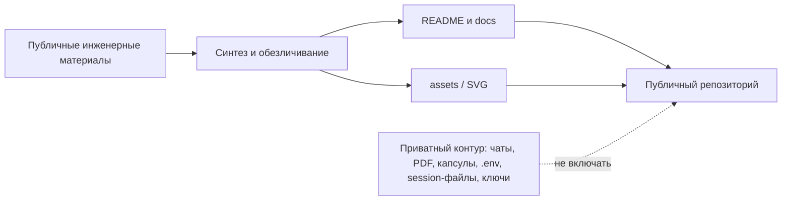

# Архитектура

Этот репозиторий устроен как публичный слой над внутренним проектом REDNET / Airin.

Главный принцип простой: наружу выходят только объяснимые, проверяемые и обезличенные материалы. Всё, что может восстановить приватный контур, рабочую сессию или личную траекторию, остаётся вне публикации.

## Слои

| Слой | Содержимое | Публичность |
|---|---|---|
| Источники для синтеза | Только публично допустимые инженерные материалы | Да |
| Публичная витрина | `README.md`, `docs/`, `assets/`, `CHANGELOG.md` | Да |
| Синтетические примеры | Обезличенные схемы, таблицы, описания | Да |
| Приватный контур | Сырой корпус, личные диалоги, `.env`, ключи, session-файлы, капсулы | Нет |
| Рабочая среда Hermes | Рабочее состояние и локальная среда | Нет |
| Будущие релизы | Пакеты установки, архивы, панели | Только после чистки |

## Базовый поток публикации

## Роль основных концептов

### Контур запуска (`Launch Survival`)

Контур запуска. Нужен для того, чтобы старт системы, вход в сессию и восстановление после сбоя были описаны как последовательность безопасных шагов, а не как магический ритуал.

Что он даёт:
- понятный стартовый маршрут;
- проверку готовности перед действием;
- минимизацию потери контекста в начале сессии;
- явное разделение запуска и боевого контура.

### Нейро-узел сервисов (`Neural Service Node`)

Микро-ЛЛМ как сервисный сигнализатор. В публичной формулировке это не центральный интеллект, а маленький узел, который помогает замечать состояние, режим и риск перегрузки.

Что он даёт:
- сигнал о текущем режиме;
- сервисную подсказку без захвата управления;
- локальную проверку, нужна ли пауза, hold или пересборка контекста;
- простой способ не смешивать наблюдение с решением.

### Сеансовые мета-навыки (`Session-guided meta-skills`)

Мета-навыки сопровождения сессии. Они не заменяют основной навык, а удерживают рамку работы:
- что уже сделано;
- что ещё не закрыто;
- что нельзя терять;
- что относится к приватному контуру и не подлежит публикации.

### Путь Нави (`Path Navi`)

Это навык семантической регенерации сырой нити после обрыва.

Смысл Пути Нави:
- сохранить тон последней фазы;
- восстановить незавершённые намерения;
- вернуть последние состояния и переходы;
- не придумывать продолжение, которого не было;
- не превращать рабочую нить в личный дневник;
- не смешивать восстановление контекста с художественной интерпретацией.

Публичная формулировка должна оставаться осторожной: Путь Нави помогает собрать рабочую связность после сбоя, но не утверждает доступ к скрытой памяти или к приватному содержимому.

## Что не входит в публичную архитектуру

- сырой корпус чатов;
- личные фрагменты диалога;
- приватные PDF и капсулы;
- точные токены, session-файлы и ключи;
- данные, по которым можно восстановить личную траекторию;
- рабочая среда Hermes как внутреннее состояние;
- любые сетевые маршруты, которые могут раскрыть приватный контур.

## Как читать этот слой

Публичная архитектура должна отвечать на четыре вопроса:

1. Что это за репозиторий?
2. Какие навыки и мета-навыки в нём описаны?
3. Где проходит граница приватности?
4. Как безопасно готовить материалы к публикации?

Если на любой из этих вопросов требуется ответ, который может раскрыть приватный контур, ответ должен остаться за пределами публичной документации.

## Будущий интерфейсный слой

Quasar / Vue можно рассматривать только как будущий кандидат для отдельной панели статусов, если такая задача появится.

Статус этого направления:
- не P0;
- не часть текущей рабочей среды;
- не обещание готовой реализации;
- только ориентир для будущей витрины.

## Границы реализации

Публичный репозиторий должен:
- объяснять проект;
- показывать режимы и границы;
- поддерживать документированный порядок релиза;
- оставаться безопасным для публикации.

Он не должен:
- обещать уже готовую UI-панель;
- скрытно тащить рабочую среду Hermes;
- включать секреты и восстановимые приватные материалы;
- выдавать гипотезу за реализованный модуль.
