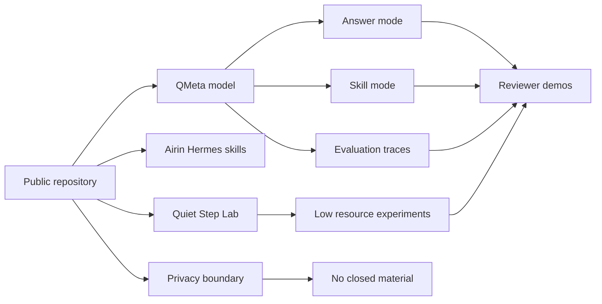
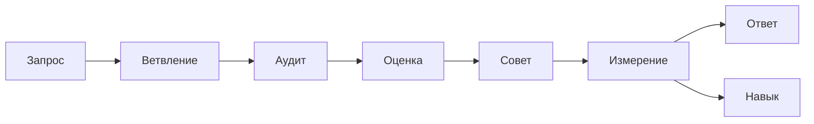
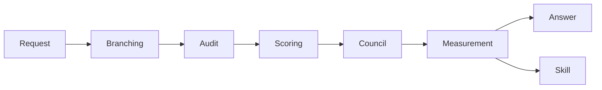

# Grant architecture map — RU / EN

> Public visual map for reviewers. Mermaid diagrams render directly on GitHub and avoid binary assets.

## RU — карта заявки

## EN — application map

## RU — процесс QMeta

## EN — QMeta process

## Review note

The map intentionally shows only public-safe layers: repository, model, skills, lab, boundary, demos and evaluation traces. Closed archives and private runtime material are outside the public graph.
