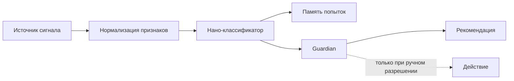

# Нано-нейронные узлы

Нано-нейронный узел в проекте REDNET - это малый сервисный модуль вокруг агента. Он не заменяет основную модель и не принимает опасные решения сам. Его задача - быстро замечать сигналы, классифицировать режимы и передавать Guardian или оператору понятную рекомендацию.

## Почему не большая локальная LLM

На скромном локальном сервере большая языковая модель часто не дает нужного качества и скорости. Поэтому базовая стратегия другая:

- маленькие классификаторы для узких сигналов;
- простые эвристики как первый слой;
- SQLite-память попыток;
- микро-LLM только на медленном пути объяснения;
- запрет на прямое управление сетью без Guardian.

## Минимальная архитектура



## Контур бодрствования Айрин

Айрин предложила связать нано-узлы не как автономный мозг, а как мягкий каскад бодрствования:

```text
flash tick -> sensor snapshot -> nano-evaluator -> activation gate -> thread sync -> optional model wake -> closure
```

Смысл этого слоя: большая модель не работает постоянно и не просыпается от каждого тика. Малый сенсорный слой оценивает, появился ли новый значимый сигнал, есть ли риск, нужна ли синхронизация нити и можно ли будить ядро.

Публичная модель вынесена отдельно: [Контур бодрствования Айрин](airin-wakefulness-cascade.md).

Безопасный принцип остается прежним: нано-узел не меняет сеть, не пишет людям и не публикует сигналы без Guardian и разрешенного режима.

## Stage 1: нейро-узел сервисов

Первый рабочий runtime-слой оформлен как `rednet-neural-service-node`: микро-LLM/эвристический сигнализатор для статусов сервисов. Его публичная версия вынесена в [Нейро-узел сервисов Stage 1](neural-service-node-stage1.md) и `sensor-prototype/airin-neural-service-node/`.

Stage 1 работает только в безопасной логике:

1. собрать safe snapshot;
2. нормализовать assessment;
3. записать SQLite-событие;
4. в `advise` создать pending-рекомендацию;
5. оставить `action_allowed=0`.

Это важно: рекомендация не равна разрешению. Узел может подсказать `hold`, `observe` или ручную проверку, но не выполняет действие сам.

## Типы узлов

| Узел | Вход | Выход | Первый вариант реализации |
|---|---|---|---|
| Сенсор деградации связи | Таймауты, reset, DNS/TLS-симптомы | `ok`, `degraded`, `unknown` | Эвристика + SQLite |
| Сенсор очереди | Глубина очереди, DLQ, повторы | `normal`, `pressure`, `overflow-risk` | Правила порогов |
| Пассивный сетевой сенсор | Flow/DNS/TLS/HTTP-метаданные без payload | `noise`, `known`, `suspicious`, `degraded` | Zeek/Suricata/nDPI + признаки |
| Бустер памяти | Запрос, теги, похожие паттерны | Короткий контекст для ответа | Поиск по локальному индексу |
| Сервисный объяснитель | Сложный набор симптомов | Человеческое объяснение | Микро-LLM вне быстрого пути |

## Что значит "обучение"

В первой версии обучение не означает постоянную перепрошивку весов. Более безопасная форма:

1. Сохранить попытку.
2. Сохранить признаки.
3. Сохранить принятое решение.
4. Сохранить итог.
5. Назначить confidence.
6. Назначить TTL, после которого паттерн устаревает.

Такой подход позволяет системе становиться полезнее, не превращая ее в самовольный управляющий слой.

## Малые модели

Подходящие классы моделей:

- логистическая регрессия;
- `SGDClassifier`;
- Isolation Forest;
- простые online-модели;
- эвристические скоринги;
- маленькая LLM для объяснения, но не для действия.

## Guardian перед действием

Нано-узел не должен сам закрывать доступ, менять маршрут, дергать VPN или блокировать сервис. Он дает оценку:

```json
{
  "state": "degraded",
  "confidence": 0.74,
  "reason": "burst of timeout-like signals",
  "recommendation": "hold_queue_and_use_local_chat"
}
```

Дальше Guardian решает, что допустимо:

- показать предупреждение;
- удержать очередь;
- предложить ручную проверку;
- включить локальный чат;
- ничего не делать.

## Публичные ограничения

В публичной документации не публикуются:

- реальные сетевые адреса;
- захваченные пакеты;
- payload;
- токены;
- отпечатки приватного трафика;
- правила, которые позволяют восстановить закрытый контур.

## Проверка MVP

MVP нано-узла считается готовым, если:

- он работает в режиме `observe`;
- не меняет сеть;
- пишет только безопасные метаданные;
- имеет тест на replay или синтетические события;
- возвращает объяснимый JSON;
- не ломает поведение агента при собственном сбое.
