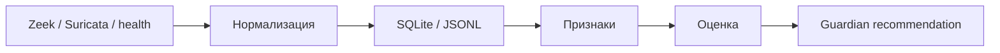

# Пассивный сигнальный сенсор

Пассивный сигнальный сенсор - это наблюдательный слой для сетевых и сервисных метаданных. Он не читает переписку, не сохраняет payload и не меняет маршруты. Его задача - превращать симптомы в признаки, а признаки в осторожную оценку состояния.

## Задача

Сенсор помогает понять, что происходит с каналами связи:

- нормальная работа;
- деградация;
- шум;
- неизвестный паттерн;
- подозрительный всплеск;
- повторяемая ошибка.

## Источники событий

Допустимые публично описываемые источники:

- Zeek events: `conn`, `dns`, `ssl`, `http`;
- Suricata `eve.json`: `flow`, `dns`, `tls`, `http`, `alert`, `stats`;
- локальные health-check статусы;
- синтетические replay-события;
- журналы без секретов.

Сырые payload и содержимое сообщений не сохраняются.

## Поток данных

## Минимальная база

| Таблица | Назначение |
|---|---|
| `sensor_events` | Нормализованные события без payload |
| `sensor_features` | Признаки потока и симптомов |
| `sensor_assessments` | Оценки `ok`, `degraded`, `suspicious`, `unknown`, `noise` |
| `pattern_memory` | Успешные и неуспешные паттерны с confidence и TTL |
| `guardian_recommendations` | Рекомендации без исполнения |

## Признаки

Примеры безопасных признаков:

- направление;
- портовая категория;
- длительность;
- размер;
- частота;
- burst-поведение;
- TCP reset;
- DNS-ошибка;
- TLS-симптом;
- повторяемость;
- источник журнала.

## Классификация первого этапа

Первый этап строится на эвристиках:

- явный DNS fail;
- burst таймаутов;
- частые reset;
- отсутствие событий от ожидаемого источника;
- очередь растет, но внешний канал молчит;
- источник жив, но классификация неизвестна.

Затем можно добавить маленький online-классификатор. Он должен работать только как советующий слой.

## Режимы

| Режим | Разрешение |
|---|---|
| `off` | Ничего не читает |
| `observe` | Читает события и пишет безопасные оценки |
| `advise` | Формирует рекомендации |
| `hold` | Может предложить удержание очереди через Guardian |
| `act` | В публичной первой версии запрещен |

## Безопасность

Сенсор не должен:

- менять маршруты;
- трогать firewall;
- переключать VPN;
- управлять роутером;
- хранить payload;
- публиковать приватные адреса;
- принимать решения без Guardian.

## Replay-тесты

Безопасный способ проверки:

1. Подготовить синтетические flow-события.
2. Прогнать сенсор без live-сети.
3. Проверить SQLite.
4. Проверить отсутствие payload.
5. Проверить оценки.
6. Проверить, что при падении сенсора агент продолжает работать.

## Что публиковать

Публиковать можно:

- архитектуру;
- таблицы;
- примеры синтетических событий;
- тестовые сценарии;
- рекомендации по режимам.

Не публиковать:

- реальные логи сети;
- приватные адреса;
- конфигурации маршрутов;
- ключи и токены;
- данные, по которым можно восстановить рабочий контур.
