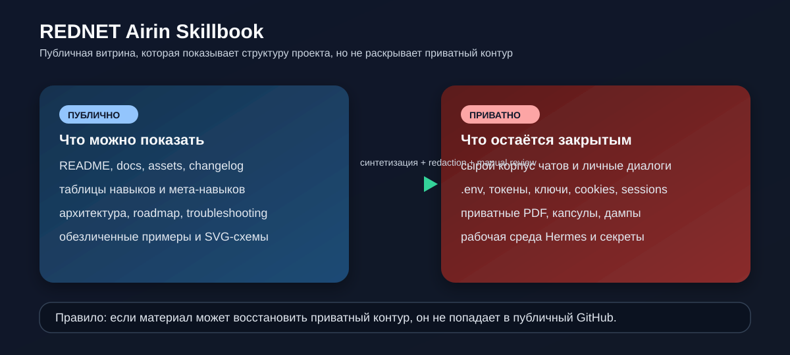

# Граница приватности

Этот документ фиксирует, что можно публиковать в будущий публичный GitHub-репозиторий `REDNET Airin Skillbook`, а что должно оставаться вне него.

Режим публикации: **private-first / public-later**.

## Можно публиковать

- синтетические и обезличенные примеры;
- таблицы по навыкам, мета-навыкам и режимам;
- архитектурные схемы без приватных данных;
- релизные заметки и changelog в человеческом виде;
- troubleshooting и ограничения;
- публично допустимые ссылки на будущие release-пакеты;
- SVG/скрин-превью, если в них нет реальных статусов, адресов, аккаунтов и личных данных;
- curated reports: ручные сводки, из которых нельзя восстановить raw inbox, ledger или личную траекторию.

## Нельзя публиковать

- сырой корпус чатов, дневники, личные диалоги;
- приватные PDF, капсулы и raw session exports;
- `.env`, ключи, cookies, session-файлы, OAuth blobs и Telegram session-файлы;
- cycle-reports, локальные runtime-выгрузки, backup/tmp-папки;
- raw `inbox/`, ledger exports, SQLite/JSONL рабочие базы;
- точные NAS/UNC-пути, приватные IP/порты и восстановимые настройки инфраструктуры;
- файлы, по которым можно восстановить личную траекторию, операторский контекст или закрытую рабочую среду.

## Пограничные случаи

| Материал | Решение |
|---|---|
| Сводка без личных подробностей | Можно публиковать как curated report. |
| Датированная рабочая выгрузка | Не публиковать как raw; заменить на обобщённую сводку или roadmap. |
| Снимок экрана с чувствительными блоками | Сначала редактировать, затем визуально проверить. |
| Лог с локальными путями | Только после обезличивания или не публиковать. |
| Цитата из внутреннего диалога | Не публиковать дословно; заменить синтетической формулировкой. |
| Иллюстрация интерфейса | Можно, если данные синтетические и нет приватных маршрутов. |
| Описание Пути Нави | Можно, если это техническая формулировка без сырой нити. |

## Публичные имена и роли

- `Airin / Айрин` допустимо как имя публичного проекта и агентного образа.
- Имена операторов, частных участников, семьи и друзей по умолчанию заменяются ролями: `оператор`, `ревьюер`, `контрибьютор`, `владелец проекта`.
- `Aletia / Алетия`, `Марсель` и другие контуры описываются как роли/контуры без переноса личной памяти, приватных диалогов или OAuth/session-данных.
- Если имя не нужно для понимания public-документа, лучше использовать роль.

## Публичные правила

1. Если есть сомнение, материал остаётся приватным.
2. Если материал можно восстановить до личного контура, его не публикуют.
3. Если нужен пример, допустима только синтетическая формулировка.
4. Если файл может содержать секреты, обязателен manual review и secret scan.
5. Если элемент относится к live Hermes/рабочей среде, он не должен попадать в этот репозиторий.
6. Сначала репозиторий готовится как приватный, и только потом открывается публично.
7. Raw-выгрузки заменяются curated reports, diagrams, module packs или roadmap без исходных данных.

## Контрольный список перед публикацией

- проверить `.gitignore` и `git status --ignored=matching`;
- найти `.env`, токены, ключи, session-файлы, cookies;
- проверить SVG, скриншоты и вложения глазами;
- убедиться, что нет raw chat, raw inbox, ledger/database dumps и cycle-reports;
- проверить архивы/ZIP или вынести их в GitHub Releases;
- проверить, что новые документы есть в Git и ссылки не ведут на untracked-файлы;
- отдельно проверить историю Git перед переводом репозитория в public.

## Troubleshooting

Если есть риск утечки:

1. убрать файл из публикации;
2. заменить сырой материал синтетической или curated-сводкой;
3. проверить, не содержит ли схема личные пути и идентификаторы;
4. пересобрать release-пакет без спорного файла;
5. повторно прогнать secret scan и link check.

Если материал выглядит безопасным, но из него можно восстановить приватный контур, считать его небезопасным.
