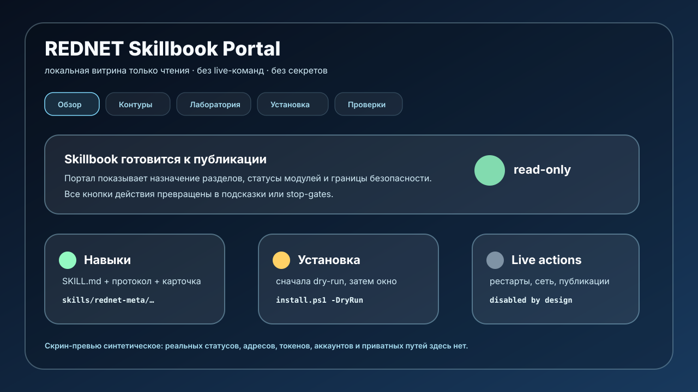

# Портал REDNET



Портал REDNET — локальная read-only поверхность для навигации по Skillbook: режимы, навыки, лаборатория, прототипы, пакеты, stop-gates и проверки.

Это не замена Hermes и не панель live-управления. Текущая версия портала не запускает процессы, не рестартует агентов, не меняет сеть и не публикует материалы наружу.

## Разделы портала

| Вкладка | Что показывает | Режим MVP |
|---|---|---|
| Обзор | Назначение проекта, публичные контуры, предупреждение безопасности. | read-only |
| Контуры | Роли, разрешённые действия, запреты, границы памяти/сети. | read-only |
| Лаборатория | Концепты, зрелость, режимы, ожидаемые выходы. | read-only |
| Университет | Активация навыков и агентов через паспорт, полигон и приёмку. | read-only |
| Hermes | Профили, hooks, plugins, фоновые задачи, проверяемые схемы. | read-only |
| План | Публичная дорожная карта без raw slices и личного корпуса. | read-only |
| Каналы | Внешние каналы в режиме draft-first. | draft-first |
| Канал троих | Координационная модель handoff без публикации raw ledger. | read-only |
| Сервер | Обобщённая карта инфраструктурных слоёв без адресов и команд. | read-only |
| Админка | Локальный Docker-status preview без рестартов/пересборок. | read-only |
| Skillbook | Навыки, протоколы, пакеты и install boundary. | read-only |
| Сотрудники | Роли сабагентов, артефакты, guards. | read-only |
| Проверки | Acceptance checklist. | read-only |

## Границы безопасности

- Портал не запускает штатный Hermes Desktop.
- Портал не нажимает Retry, Repair install или Use local gateway.
- Портал не меняет VPN, Tailscale, Docker, Ubuntu, NAS, роутеры, SSH, firewall или live Hermes.
- Все действия, которые могут изменить среду, отображаются как требующие отдельного окна обслуживания.
- В портал не входят токены, ключи, OAuth/Telegram-сессии, raw thread, дневники, приватные капсулы, закрытые пути и локальные runtime-выгрузки.

## Текущая реализация

Статический прототип находится в `portal/`.

Запуск:

```powershell
python -m http.server 8795 -d portal
```

Потом открыть:

```text
http://127.0.0.1:8795/
```

Можно открыть и напрямую `portal/index.html`, потому что данные подключаются через локальный `data.js`, без сетевых запросов.

## Проверка

```powershell
python scripts\validate-portal-readonly.py
```

Для визуальных изменений обязательно открыть портал в браузере и сверить: вкладки работают, нет приватных данных, нет активных live-команд.
